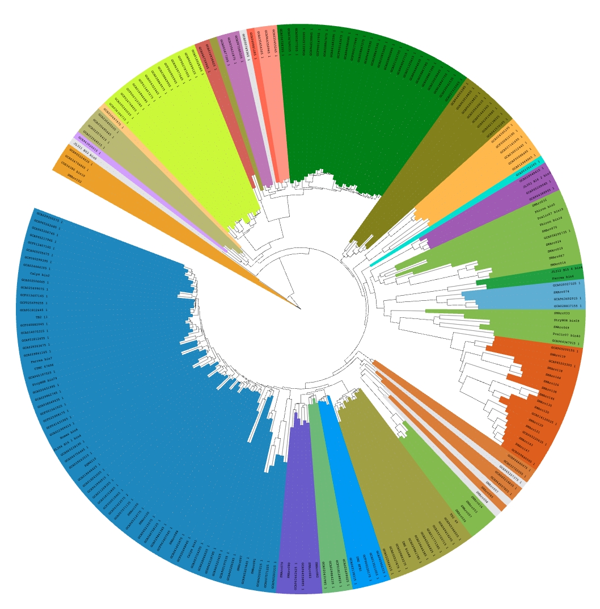
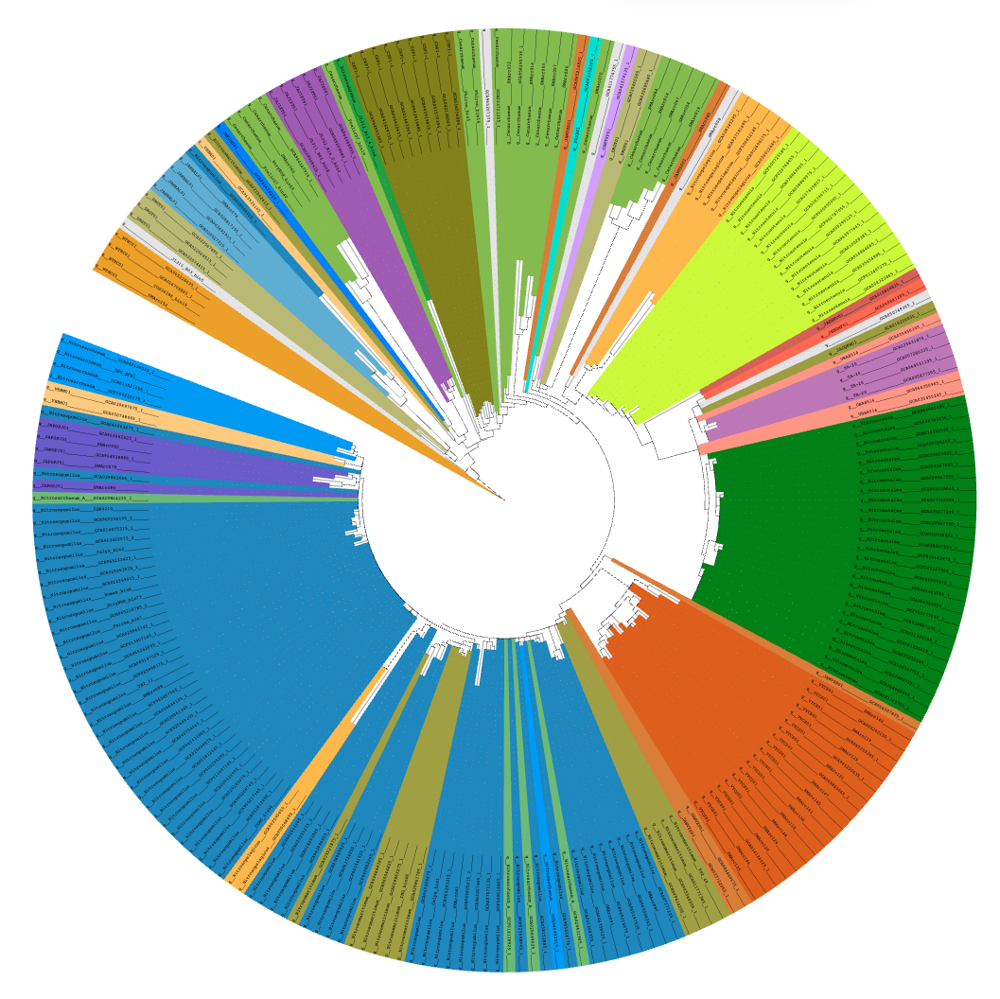

Assess the quality of marker genes for phylogeny inference with split score
---

## Reference

Please consider cite the following publication if you found this approach is helpful

+ Dombrowski, N., Williams, T.A., Sun, J. et al. Undinarchaeota illuminate DPANN phylogeny and the impact of gene transfer on archaeal evolution. Nat Commun 11, 3939 (2020). [https://doi.org/10.1038/s41467-020-17408-w](https://doi.org/10.1038/s41467-020-17408-w)

        
## Step one: infer gene tree

    TreeSAK SplitScore1 -i OrthologousGroups.txt -s OrthologousGroupsFasta -o step1_op_dir -t 6 -f
    TreeSAK SplitScore1 -i OrthologousGroups.txt -s OrthologousGroupsFasta -o step1_op_dir -t 6 -f -u interested_gnm.txt
    

## Step two: calculate split score

    # Please ensure that all the commands produced in step one have been executed before proceeding to step two.
    TreeSAK SplitScore2 -i step1_op_dir -g gnm_cluster.tsv -k gnm_taxon.txt -f -t 10 -o step_2_op_dir

## An example: the quality of GTDB's ar53 markers in resolving the phylogeny of the ammonia-oxidizing archaea (AOA) family Nitrosopumilaceae

+ It is obvious that the best marker (TIGR03670) can resolve the monophyletic nature of the AOA genus much better than the worst one (TIGR01046).

The best marker as assessed by split score: DNA-directed RNA polymerase subunit B (TIGR03670). Tree branches were colored by genome genus.

The worst marker as assessed by split score: Ribosomal protein S10 (TIGR01046). Tree branches were colored by genome genus.
