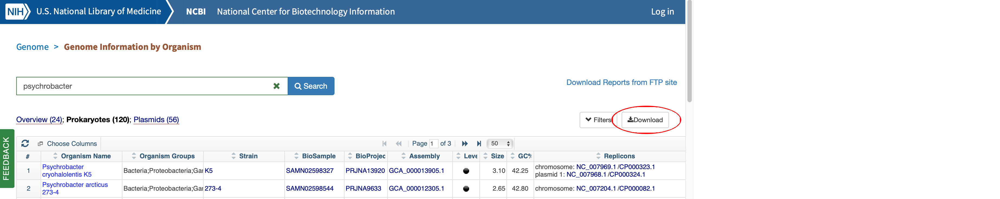

### Download GenBank genomes

   1. Go to https://www.ncbi.nlm.nih.gov/genome/browse#!/prokaryotes/refseq_category:reference
   
   1. Search genomes you want to download (e.g. Alteromonas, Archaea)
   
   1. Save search results by clicking the "Download" icon.
   

   1. Download genomes with `BioSAK dwnld_GenBank_genome`
    
          cd /srv/scratch/$zID/BioSAK_demo/OtherFiles
          BioSAK dwnld_GenBank_genome -csv prokaryotes.csv -fna -name

