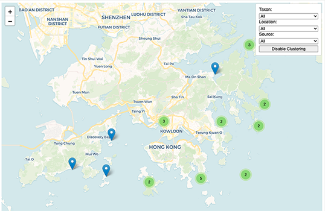

Script for generating a single-page website to visualize biodiversity data
---

### Produce a webpage without bar chart
  
    python3 get_single_page_web.py -m doc/metadata.txt -w doc/template.html -o single_page_web.html

### Produce a webpage with bar chart

    python3 get_single_page_web.py -m doc/metadata.txt -w doc/template_with_barchart.html -o single_page_web_with_barchart.html

