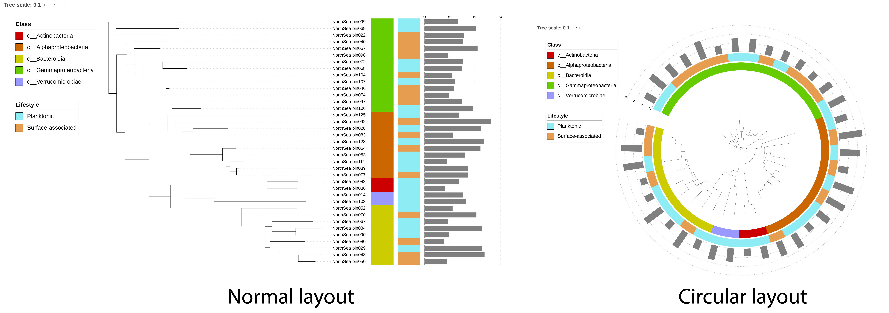
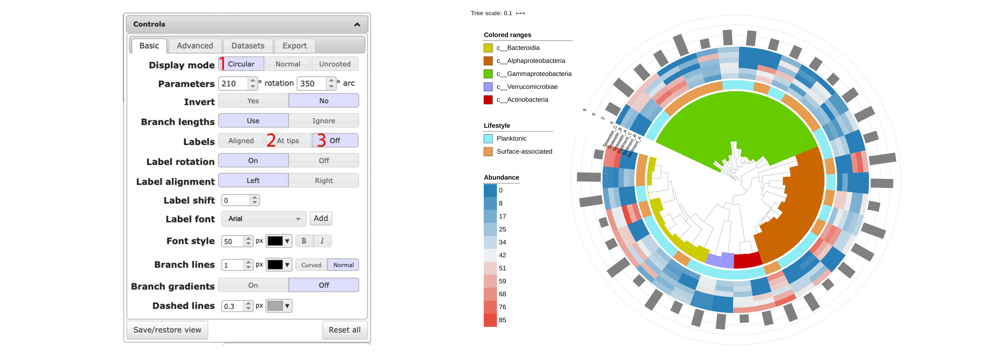

## Tree visualization with [iTOL](https://itol.embl.de)

1. Here, I have a phylogenetic tree for 37 MAGs derived from microbial communities (either surface-associated or planktonic) sampled in North Sea.
I have the taxonomy info of these MAGs at class level and I also have their sizes.
This short note shows how to visualize all these info in one figure.

1. Download needed files: [files_needed.zip](files_needed.zip)

1. File description (all files need to be prepared according to iTOL's syntax):

    + A phylogenetic tree in [Newick](http://evolution.genetics.washington.edu/phylip/newicktree.html) format: [NorthSea_0_Tree.newick](files_needed/NorthSea_0_Tree.newick)
    + Taxonomy info: [NorthSea_1_Taxon_ColorStrip.txt](files_needed/NorthSea_1_Taxon_ColorStrip.txt), [NorthSea_1_Taxon_Range.txt](files_needed/NorthSea_1_Taxon_Range.txt)
    + Life-style info: [NorthSea_2_LifeStyle.txt](files_needed/NorthSea_2_LifeStyle.txt)
    + MAG size info: [NorthSea_3_MAG_Size.txt](files_needed/NorthSea_3_MAG_Size.txt)

1. Upload **NorthSea_0_Tree.newick** to iTOL via [https://itol.embl.de/upload.cgi](https://itol.embl.de/upload.cgi).

1. Once you have the tree uploaded, you'll see the skeleton of the tree without any decoration. 
You can now play around with the control panel on the right side (e.g. change tree layout to circular).

1. We are going to add the taxonomy info of our MAG to the tree now, which is really easy to do in iTOL. 
You just need to drag and drop **NorthSea_1_Taxon_ColorStrip.txt**  to the **tree area**.

1. Do the same thing to **NorthSea_2_LifeStyle.txt** and **NorthSea_3_MAG_Size.txt** to add life-style and size info, 
you'll see trees like this:

1. To get a tree with a circular layout and MAG classes coloured as in the figure below. 
You need to use **NorthSea_1_Taxon_Range.txt** instead of **NorthSea_1_Taxon_ColorStrip.txt**,
choose "**Circular**" mode in the control panel, click "**At tips**" and then turn it **off**.

1. Go to the **Export** panel, choose desired file format and export your tree plot to file. 
Remember to turn on **Colored ranges legend**, if you are using **NorthSea_1_Taxon_Range.txt** to color MAG classes.

# Help information

1. More examples and help information can be found from iTOL's help page: [https://itol.embl.de/help.cgi](https://itol.embl.de/help.cgi)
1. The Newick tree format: [http://evolution.genetics.washington.edu/phylip/newicktree.html](http://evolution.genetics.washington.edu/phylip/newicktree.html)
1. Hex Color Codes: [https://htmlcolorcodes.com](https://htmlcolorcodes.com) and [https://www.color-hex.com](https://www.color-hex.com)
