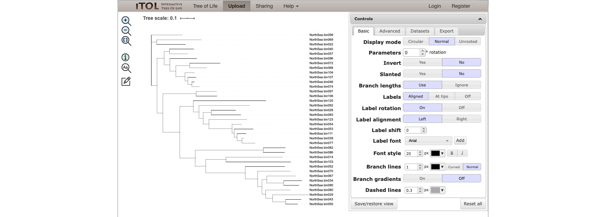
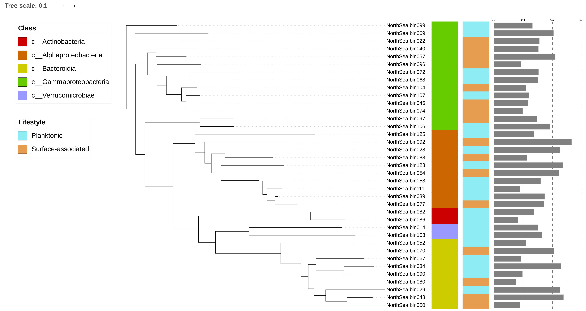
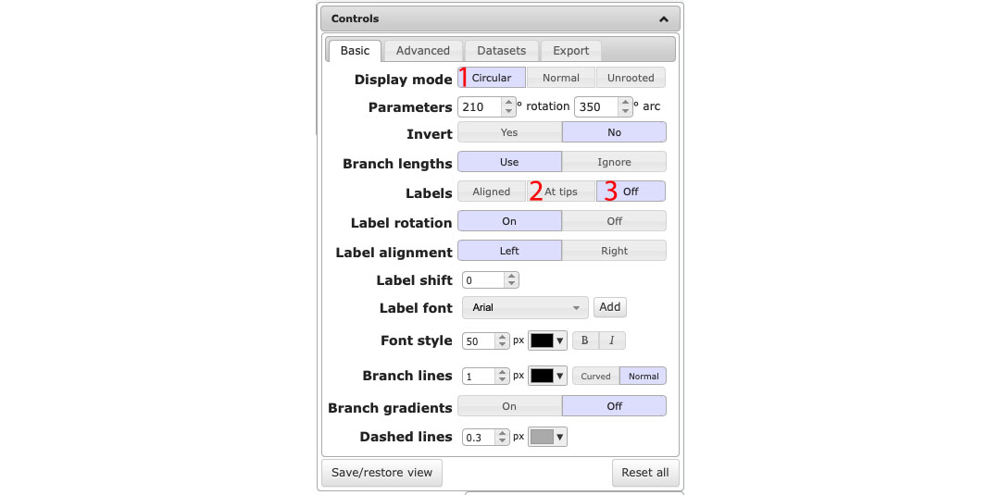
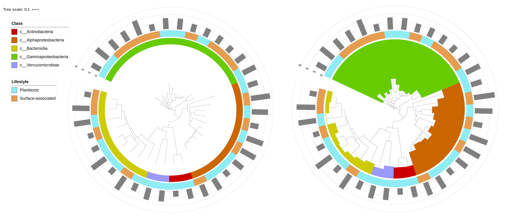

## Tree visualization with [iTOL](https://itol.embl.de)

1. Here, I have a phylogenetic tree for 37 MAGs derived from microbial communities (either surface-associated or planktonic) sampled in North Sea.
I have the taxonomy info of these MAGs at class level and I also have the size of these MAGs.
This tutorial shows how to visualize all these info in one figure.

1. Files needed (all these files need to be formatted according to iTOL's requirement):

    + A phylogenetic tree in Newick format: [NorthSea_0_Tree.newick](NorthSea_0_Tree.newick)
    + Taxonomy info: [NorthSea_1_Taxon_ColorStrip.txt](NorthSea_1_Taxon_ColorStrip.txt), [NorthSea_1_Taxon_Range.txt](NorthSea_1_Taxon_Range.txt)
    + Life-style info: [NorthSea_2_LifeStyle.txt](NorthSea_2_LifeStyle.txt)
    + MAG sizes: [NorthSea_3_MAG_Size.txt](NorthSea_3_MAG_Size.txt)

1. Upload your tree ([NorthSea_0_Tree.newick](NorthSea_0_Tree.newick)) to iTOL via [https://itol.embl.de/upload.cgi](https://itol.embl.de/upload.cgi).

1. Once you have your tree uploaded, you'll see the skeleton of your tree without any decoration. 
You can now play around with the control panel on the right side (e.g. change tree layout to circular).

2. We are going to add the taxonomy info of our MAG to the tree now, which is really easy to do in iTOL. 
You just need to drag and drop the [NorthSea_1_Taxon_ColorStrip.txt](NorthSea_1_Taxon_ColorStrip.txt) file to the tree area.

3. Do the same thing to file [NorthSea_2_LifeStyle.txt](NorthSea_2_LifeStyle.txt) and [NorthSea_3_MAG_Size.txt](NorthSea_3_MAG_Size.txt) to add life-style and size info, you'll see a tree like this:

4. To get a tree with a circular layout and MAG classes coloured as in the right figure below. 
You need to use [NorthSea_1_Taxon_Range.txt](NorthSea_1_Taxon_Range.txt) instead of NorthSea_1_taxon.txt,
choose "Circular" mode in the control panel, click "At tips" and then turn it off.

# Help information

1. More examples and help information can be found from iTOL's help page: [https://itol.embl.de/help.cgi](https://itol.embl.de/help.cgi)
1. The Newick tree format: [http://evolution.genetics.washington.edu/phylip/newicktree.html](http://evolution.genetics.washington.edu/phylip/newicktree.html)
1. Hex Color Codes: [https://htmlcolorcodes.com](https://htmlcolorcodes.com) and [https://www.color-hex.com](https://www.color-hex.com)
