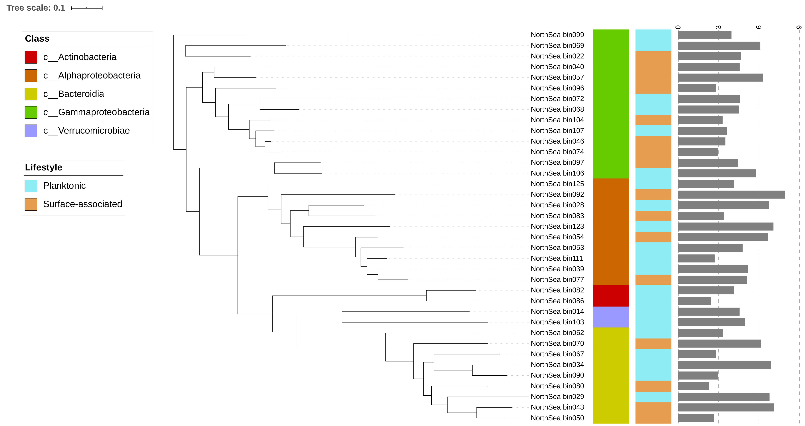
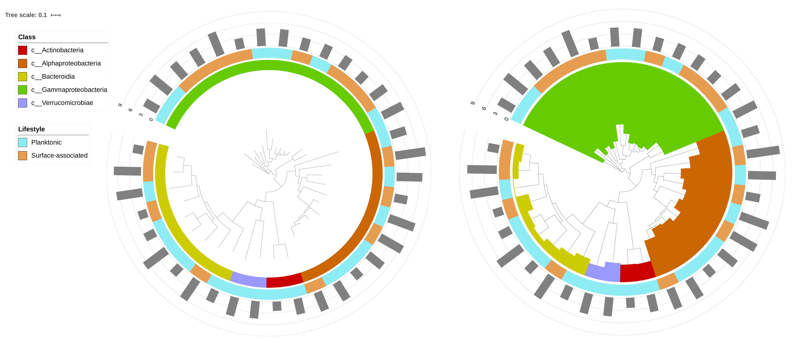

## Tree visualization with [iTOL](https://itol.embl.de)

## Example files

1. Upload your tree to iTOL via [https://itol.embl.de/upload.cgi](https://itol.embl.de/upload.cgi)

1. Once you have your tree uploaded, you'll see 

## Visualize tree with normal layout

## Visualize tree with circular layout (different ways to color classes)

# Help information

1. More examples and help information can be found from iTOL's help page: [https://itol.embl.de/help.cgi](https://itol.embl.de/help.cgi)
1. The Newick tree format: [http://evolution.genetics.washington.edu/phylip/newicktree.html](http://evolution.genetics.washington.edu/phylip/newicktree.html)

   

