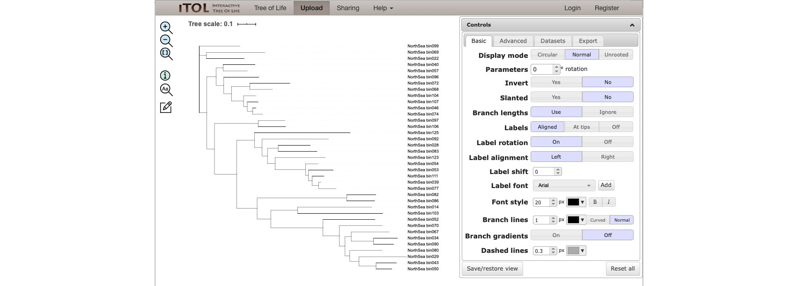
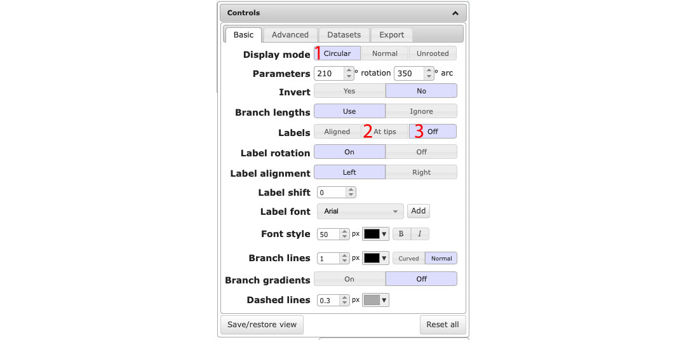

## Tree visualization with [iTOL](https://itol.embl.de)

## Demo

1. Here, I have a phylogenetic tree for 37 MAGs derived from microbial communities (either surface-associated or planktonic) collected in North Sea.
I have the taxonomy info of these MAGs at phylum and class level and I also know the size of these MAGs.
This tutorial will show how to visualize all these info in one figure.

1. Upload your tree ([NorthSea.newick](NorthSea.newick)) to iTOL via [https://itol.embl.de/upload.cgi](https://itol.embl.de/upload.cgi).

1. Once you have your tree uploaded, you'll see the skeleton of your tree, without any decoration. 
You can now play around with the control panel on the right side (e.g. change tree layout to circular).

2. We are going to add the taxonomy info of our MAG to the tree now, and this is really easy in iTOL. 
You just need to drag and drop the [NorthSea_1_taxon.txt](NorthSea_1_taxon.txt) file to the tree area.

3. Do the same thing for [NorthSea_2_bin_source.txt](NorthSea_2_bin_source.txt) and [NorthSea_3_bin_size_norm.txt](NorthSea_3_bin_size_norm.txt), you'll see the tree below.

4. To get the tree with a circular layout and MAG classes colored as in the bottom right figure. 
You need to use file [NorthSea_1_taxon_range.txt](NorthSea_1_taxon_range.txt) instead of NorthSea_1_taxon.txt. 
Choose "Circular" mode in the control panel, click "At tips" for the Labels and then turn it off.

## Visualize tree with normal layout

## Visualize tree with circular layout (different ways to color classes)

# Help information

1. More examples and help information can be found from iTOL's help page: [https://itol.embl.de/help.cgi](https://itol.embl.de/help.cgi)
1. The Newick tree format: [http://evolution.genetics.washington.edu/phylip/newicktree.html](http://evolution.genetics.washington.edu/phylip/newicktree.html)
1. Hex Color Codes: [https://htmlcolorcodes.com](https://htmlcolorcodes.com) and [https://www.color-hex.com](https://www.color-hex.com)
