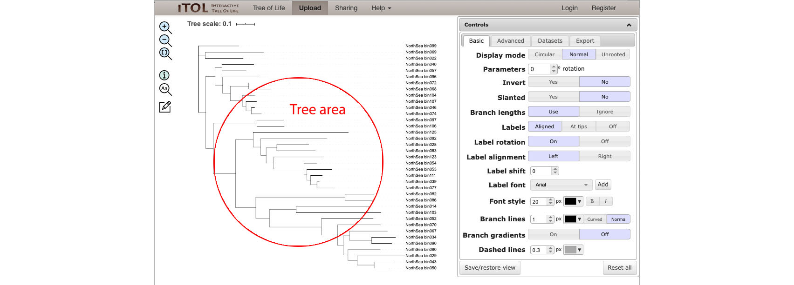
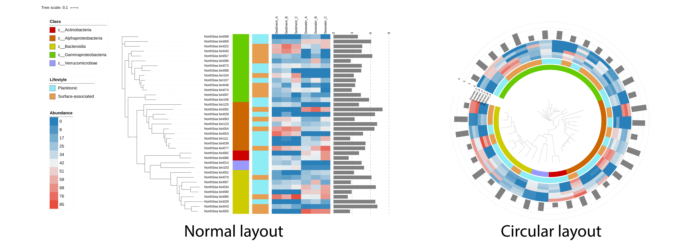

## Tree visualization with [iTOL](https://itol.embl.de)

1. Here, I have a phylogenetic tree for 37 MAGs derived from six microbial communities, either surface-associated or planktonic.
I have the taxonomic information of these MAGs at the class level, their sizes and relative abundances across the samples.
This short note shows how to visualize all these info in one Figure.

1. Description of example files (columns in all files are tab separated):

    + [tree.newick](files_needed/tree.newick): phylogenetic tree in [Newick](http://evolution.genetics.washington.edu/phylip/newicktree.html) format
    + [abundance.txt](files_needed/abundance.txt): relative abundance across samples
    + [lifestyle.txt](files_needed/lifestyle.txt): lifestyle, either surface-associated or planktonic
    + [size.txt](files_needed/size.txt): genome size in Mbp
    + [taxon.txt](files_needed/taxon.txt): taxonomy
    + [color_lifestyle.txt](files_needed/color_lifestyle.txt): (optional) lifestyle color, provide as Hex Color Codes
    + [color_taxon.txt](files_needed/color_taxon.txt): (optional) taxon color, provide as Hex Color Codes

1. Here, we are going to use BioSAK's iTOL module to prepare iTOL recognizable files for our data.
Please refer to its [manual page](https://github.com/songweizhi/BioSAK) for installation.
Here are some other [tools](https://itol.embl.de/help.cgi#external) suggested by iTOL.
      
       BioSAK iTOL -ColorRange -lg taxon.txt -lt Class -out iTOL_taxon_Range.txt -gc color_taxon.txt
       BioSAK iTOL -ColorStrip -lg taxon.txt -lt Class -out iTOL_taxon_Strip.txt -gc color_taxon.txt
       BioSAK iTOL -ColorStrip -lg lifestyle.txt -lt Life_Style -out iTOL_lifestyle.txt -gc color_lifestyle.txt
       BioSAK iTOL -Heatmap -lm abundance.txt -lt Abundance -out iTOL_abundance.txt
       BioSAK iTOL -SimpleBar -lv size.txt -scale 0-3-6-9 -lt Size -out iTOL_size.txt
       
       # for help
       BioSAK iTOL -h

1. Upload [tree.newick](files_needed/tree.newick) to iTOL via [https://itol.embl.de/upload.cgi](https://itol.embl.de/upload.cgi).

1. Once you have the tree uploaded, you'll see the skeleton of the tree without any decoration. 
You can now play around with the control panel on the right side (e.g. change tree layout to circular).

1. We are going to add the taxonomy info of our MAG to the tree now, which is really easy to do in iTOL. 
You just need to drag and drop **iTOL_taxon_Strip.txt**  to the **tree area**.

1. Do the same thing to **iTOL_lifestyle.txt**, **iTOL_abundance.txt** and **iTOL_size.txt** to add life-style, abundance and size info, 
you'll see trees like this:

1. To get a tree with a circular layout and MAG classes coloured as in the figure below. 
You need to use **iTOL_taxon_Range.txt** instead of **iTOL_taxon_Strip.txt**,
choose "**Circular**" mode in the control panel, click "**At tips**" and then turn it **off**.

1. Go to the **Export** panel, choose desired file format and export your tree to file. 
Remember to turn on **Colored ranges legend**, if you are using **iTOL_taxon_Range.txt** to color MAG classes.

# Help information

1. More examples: [https://itol.embl.de/help.cgi](https://itol.embl.de/help.cgi)
1. The Newick tree format: [http://evolution.genetics.washington.edu/phylip/newicktree.html](http://evolution.genetics.washington.edu/phylip/newicktree.html)
1. Hex Color Codes: [https://htmlcolorcodes.com](https://htmlcolorcodes.com) and [https://www.color-hex.com](https://www.color-hex.com)
