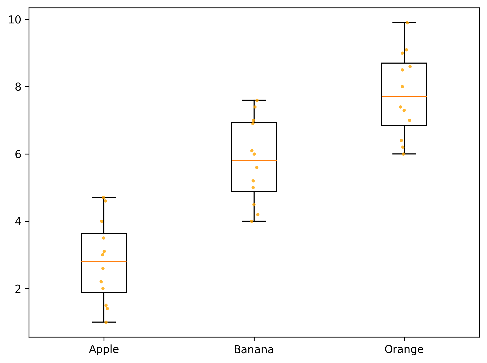
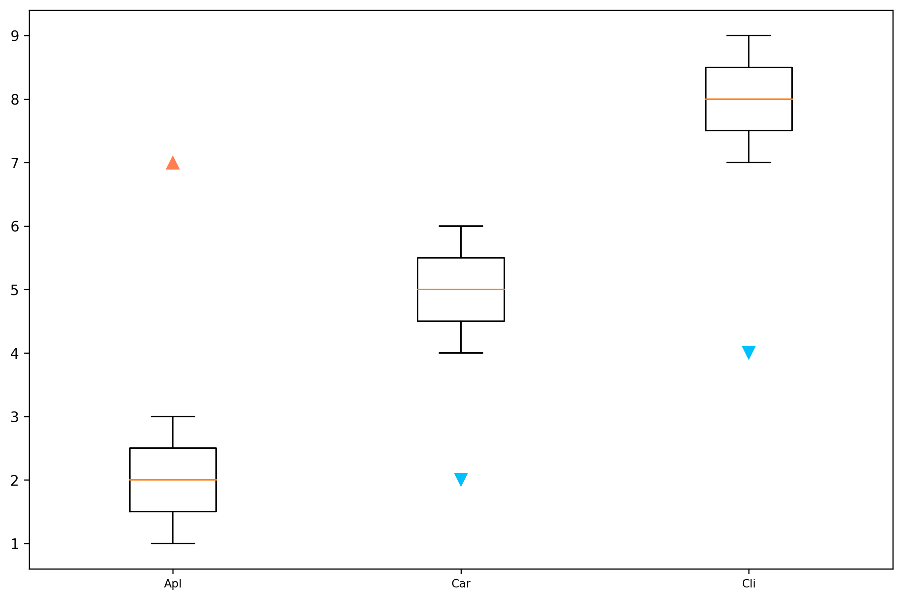
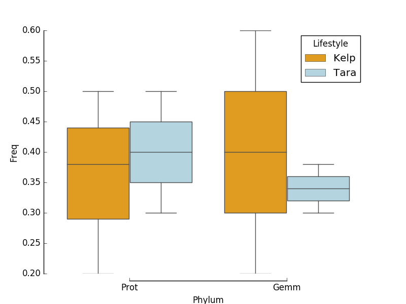
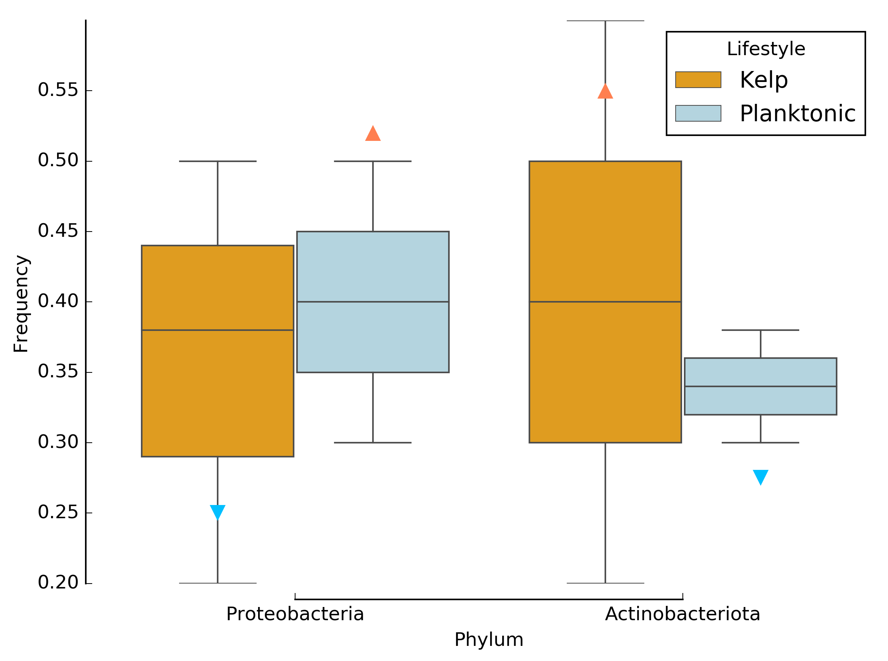
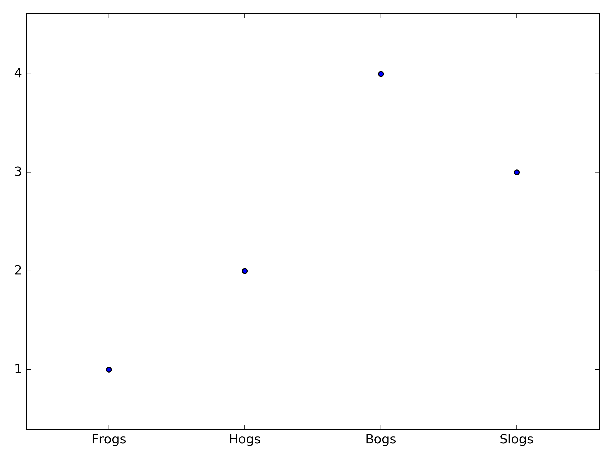
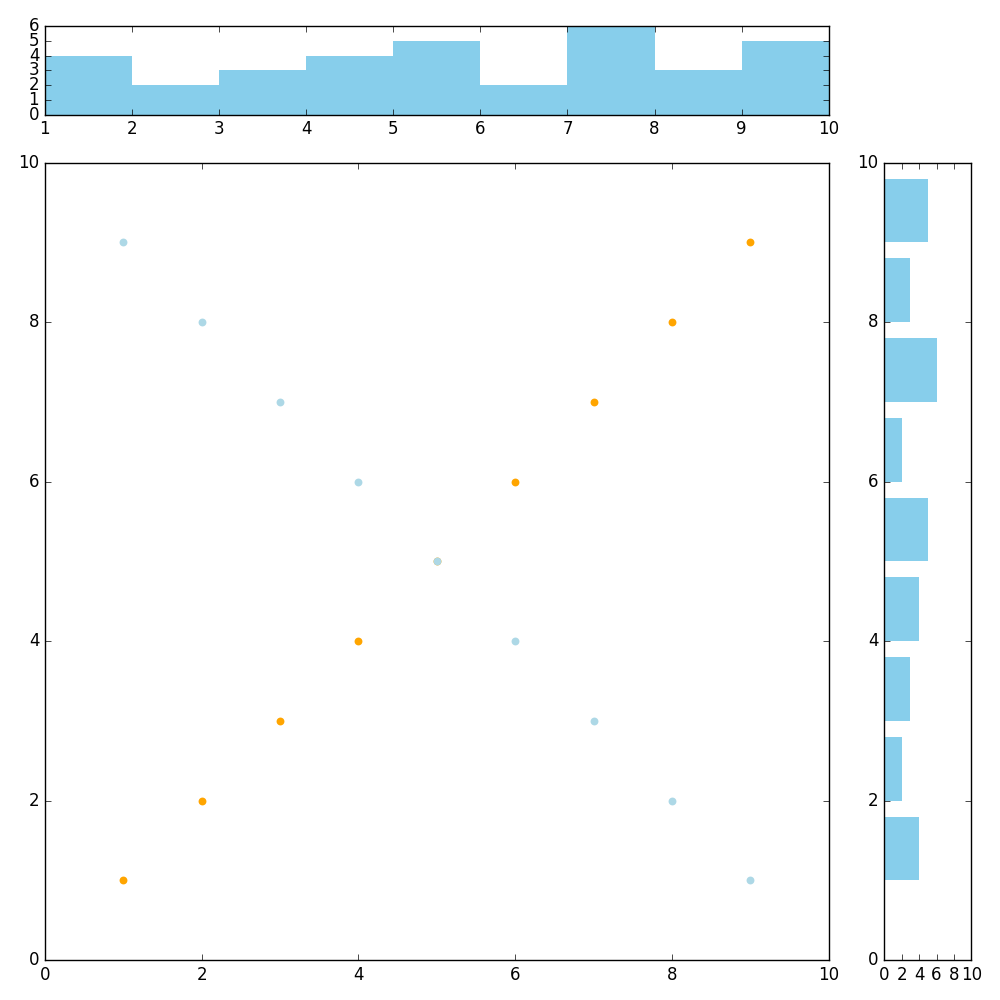

Example plots in python.
------

1. Basic barplot [[basic_plot.py](basic_plot.py)]
   

1. Boxplot with dots [[basic_plot.py](basic_plot.py)]
   

1. Boxplot with extra values [[Boxplot_with_extra_values.py](Boxplot_with_extra_values.py)]
   

1. Grouped boxplot [[grouped_boxplot.py](grouped_boxplot.py)]
   

1. Grouped boxplot with extra values [[Grouped_boxplot_with_extra_values.py](Grouped_boxplot_with_extra_values.py)]
   

1. Categorical scatter plot [[basic_plot.py](basic_plot.py)]
   

1. Customize subplots [[customized_subplots.py](customized_subplots.py)]
   

Useful Links:
------

1. Plotly Python Library
https://plot.ly/python/

2. Make a Heatmap
http://help.plot.ly/make-a-heatmap/
