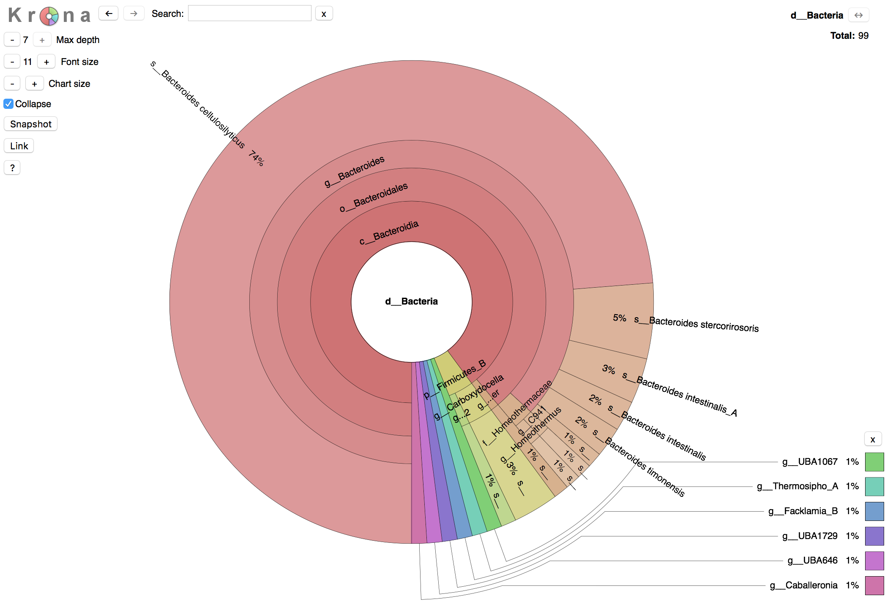

Taxonomy classification based on GTDB (http://gtdb.ecogenomic.org)
---
+ Contact: Weizhi Song (songwz03@gmail.com)
+ Affiliation: The Centre for Marine Bio-Innovation (CMB), The University of New South Wales, Sydney, Australia

Dependencies
---

+ [BioPython](https://github.com/biopython/biopython.github.io/)
+ [BLAST+](https://blast.ncbi.nlm.nih.gov/Blast.cgi?PAGE_TYPE=BlastDocs&DOC_TYPE=Download)
+ [HMMER](http://hmmer.org)
+ [KronaTools](https://github.com/marbl/Krona/wiki)
+ [Genome Taxonomy Database (GTDB)](http://gtdb.ecogenomic.org)

Change Log
---
None

Help information
---

!!! Note !!!

1. TCG only support the classification of bacterial genomes so far, the classification for Archaeal genomes will be supported after their corresponding db files are available for download from GTDB (http://gtdb.ecogenomic.org/downloads).

1. It takes about 40 seconds for the process of each query genome.

        python3 TCG.py -h

        arguments:
          -i                    folder holds the annotation file of input genomes
          -c                    confidence level (must higher than 50), default: 80
          -tuning               tuning mode
          -bac120hmm            path to bac120.HMM
          -blastdb              path to blast db folder: bac120_msa_individual_genes_r83
          -taxondb              path to file: taxonomy_r83.tsv
          -hmmsearch            path to hmmsearch, default: hmmsearch
          -blastp               path to blastp, default: blastp
          -ktImportText         path to ktImportText (from KronaTools), default: ktImportText

Prepare database files
---

        # Create a folder wherever you want to hold GTDB database files
        $ mkdir TCG_GTDB
        $ cd TCG_GTDB

        # download hmm profiles of the 120 bacterial marker genes
        $ wget https://raw.githubusercontent.com/songweizhi/TCG/master/db_files/bac120.HMM.gz
        $ gzip -d bac120.HMM.gz

        # Download bac_taxonomy_r83.tsv from GTDB
        $ wget https://data.ace.uq.edu.au/public/gtdb/release83/bac_taxonomy_r83.tsv

        # Download bac120_msa_individual_genes_r83.tar.gz from GTDB and unzip it
        $ wget https://data.ace.uq.edu.au/public/gtdb/release83/bac120_msa_individual_genes_r83.tar.gz
        $ mkdir bac120_msa_individual_genes_r83
        $ tar -xzvf bac120_msa_individual_genes_r83.tar.gz -C bac120_msa_individual_genes_r83

        # get blast database
        $ python path/to/get_db.py -in bac120_msa_individual_genes_r83

        # The generated blast databases are in bac120_msa_individual_genes_r83_db

Input files and arguments
---
You may want to try with different confidence levels after the first run. By specifying the '-tuning' option, TCG will skip the blast step and read in blast results from the last ran.

        # first run with a confidence level of 80%
        $ python TCG.py -bac120hmm path/to/bac120.HMM -blastdb path/to/bac120_msa_individual_genes_r83_db -taxondb path/to/bac_taxonomy_r83.tsv -i human_gut_bins -c 80

        # you may want to try with a different confidence level (e.g. 90%)
        $ python TCG.py -bac120hmm path/to/bac120.HMM -blastdb path/to/bac120_msa_individual_genes_r83_db -taxondb path/to/bac_taxonomy_r83.tsv -i human_gut_bins -c 90 -tuning

Output files
---

1. Taxonomy classification for each query genome

        Genome	Assignment	Confidence_level(%)
        bin349	o__RF39	86.73
        bin358	o__RF39	88.39
        bin388	g__Zag111	95.41
        bin372	g__CAG-710	89.72
        bin342	g__CAG-552	91.3
        bin399	g__CAG-914	82.57
        bin98	s__PeH17 sp1	85.98
        bin325	c__Clostridia	81.19
        bin333	c__Bacteroidia	80.43
        bin335	p__Firmicutes	80.68
        bin417	g__Bacteroides_A	88.7
        bin799	f__Ruminococcaceae	80.0
        bin80	p__Proteobacteria	80.19

1. Visualization with Krona plot

    

