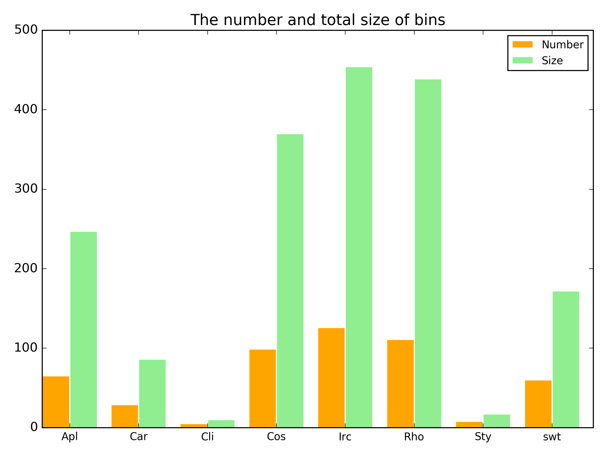
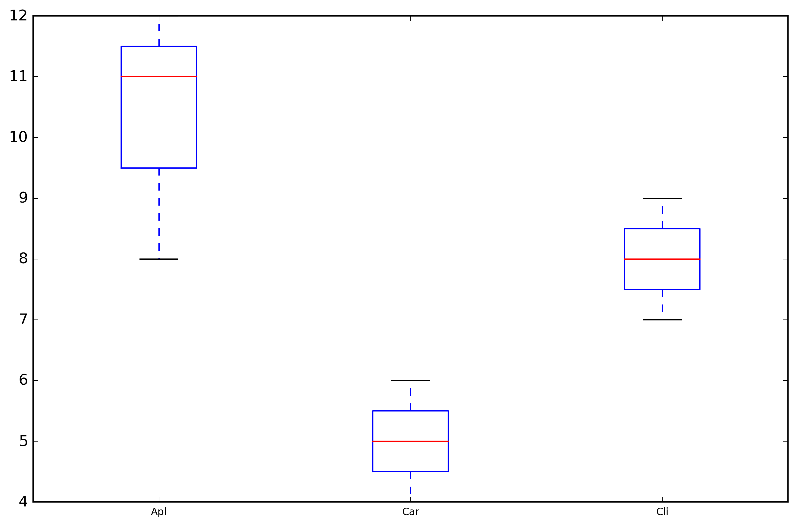

# About

##Examples to plot in python.

####bar_plot
   

####box_plot
   

#####Useful Links:

1. Plotly Python Library
https://plot.ly/python/

2. Make a Heatmap
http://help.plot.ly/make-a-heatmap/