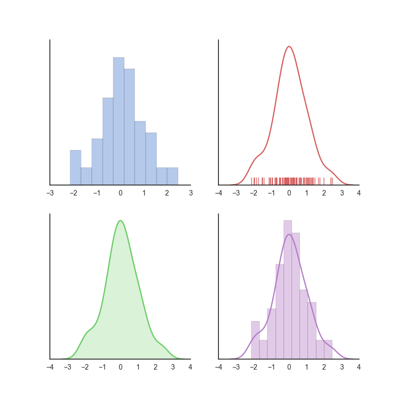

# About

##Examples to plot in python.

####2D_line
   

####2D_scatter_1
   

####2D_scatter_2_dot_size
   

####2D_scatter_3_groups
   

####Density_plot_gaussian_kde
   

####Distribution_plot_4_in_1
   

####Heatmap_in_ploty
   

####Add_text_in_matplotlib
   

####3D_scatter
   

#####Useful Links:

1. Plotly Python Library
https://plot.ly/python/

2. Make a Heatmap
http://help.plot.ly/make-a-heatmap/